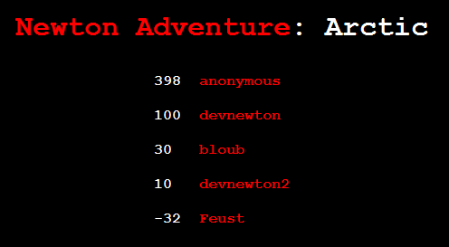
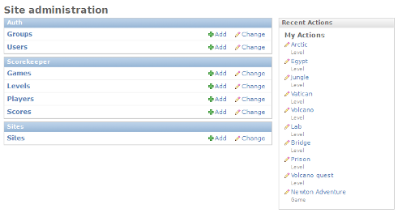
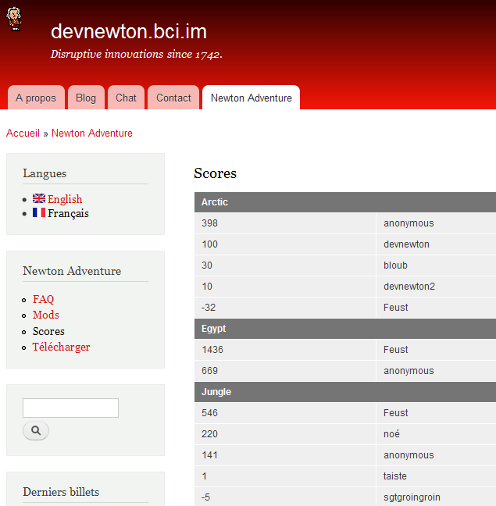

scoreserver is a django application to store and show game highscores.
While it can be used with virtually any game, it was developped to keep
Newton Adventure highscores.

Features
========

Frontend
--------

The frontend allows to browse games, levels and players highscore
tables.

Backend
-------

The backend allows administrator to create games and levels. Players and
scores can be edited or removed.

Integration with ajax
---------------------

A simple ajax request is needed to add highscore table to any website.

